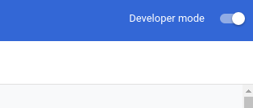
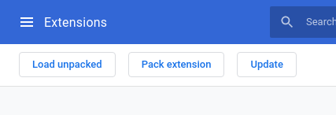
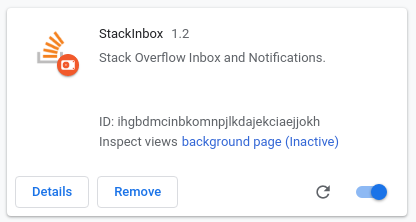

<p align="center">
  <!-- ALL-CONTRIBUTORS-BADGE:START - Do not remove or modify this section -->
  [](#contributors)
  <!-- ALL-CONTRIBUTORS-BADGE:END --> 
</p>

# StackInbox

**StackInbox** is a Google Chrome extension for Stack Overflow inbox and notifications.

# Installation

Clone the repo and navigate to the project folder and run:

```
npm ci
```

```
npm run build
```

## Adding to Chrome

Open Google Chrome and navigate to ```chrome://extensions/```

Enable ```Developer mode``` from the top right.



Click the ```Load unpacked``` button to load the extension.



Navigate to the ```public``` folder in the extension's directory and click okay.

The **StackInbox** extension will now be visible.



# Contributors ✨

Thanks goes to these wonderful people ([emoji key](https://allcontributors.org/docs/en/emoji-key)):

<!-- ALL-CONTRIBUTORS-LIST:START - Do not remove or modify this section -->
<!-- prettier-ignore-start -->
<!-- markdownlint-disable -->
<table>
  <tr>
    <td align="center"><a href="https://www.marcochavez.info/"><br /><sub><b>Marco Chavez</b></sub></a><br /><a href="https://github.com/devcshort/stack-inbox/commits?author=mxrcochxvez" title="Tests">⚠️</a></td>
    <td align="center"><a href="https://www.chrisrshort.com"><br /><sub><b>Chris Short</b></sub></a><br /><a href="#projectManagement-devcshort" title="Project Management">📆</a></td>
    <td align="center"><a href="http://navendu.me"><br /><sub><b>Navendu Pottekkat</b></sub></a><br /><a href="https://github.com/devcshort/stack-inbox/commits?author=navendu-pottekkat" title="Documentation">📖</a></td>
  </tr>
</table>

<!-- markdownlint-enable -->
<!-- prettier-ignore-end -->
<!-- ALL-CONTRIBUTORS-LIST:END -->

This project follows the [all-contributors](https://github.com/all-contributors/all-contributors) specification. Contributions of any kind welcome!
